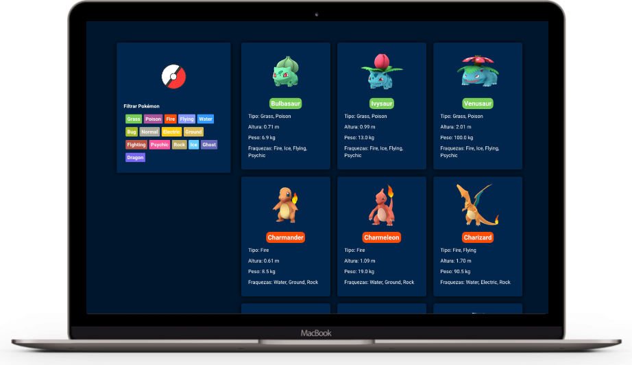

# 💡 Poké Finder - Uma biblioteca de pokémons

Esse projeto é uma iniciativa pessoal para treinar os conhecimentos sobre o framework ReactJS. 
Esses sistema consome dados de uma API de pokémons e os exibe organizadamente para o usuário, ao lado esquerda da tela há um filtro que permite escolher qual o tipo do pokémon deve ser listado. 
É simples, mas pude reforçar aprendizados anteriores, como por exemplo, passagem de dados por componentes, eventos, estados, hooks, funções assincronas, estilos(css), responsividade, manipulação de dados. 

Script de criação: `create-react-app nomeDoProjeto`

## 📚 Dependencias do projeto

Para esse sistema foi usada as seguintes dependencias :

1. Axios - para consumo da API.

## 🎉 Executar este projeto

1. Instale as dependencias: `yarn install` ou `npm i`

2. Execute o projeto: `yarn start` ou `npm start`

## ‼️ Trabalhos futuros
O objetivo é implementar neste sistema uma escolha de tema(dark/light).